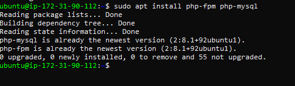

**INSTALLING THE NGINX WEB SERVER**
I signed up and created a new Ubuntu Instance for my Project 2 and named it ubuntu server2 
LEMP stack which generated a .pem file which I downloaded from AWS to my PC.
I then connected to the server using the ssh and the .pem file with the windows Terminal ssh -i "project.pem" ubuntu@ec0-00-00-00-0.compute-1.amazonaws.com

I updated and upgraded the server using `sudo apt-get update and sudo apt install nginx`.

checked status using `sudo systemctl status nginx` which shows green dot to confirm the status active.

i ran `curl http://localhost:80` to confirm if I can access it locally on ubunte shell.

I lunched Nginx server  through the Internet web browser by using the public IP address on our EC2 instance 

http://<Public-IP-Address>:80

*INSTALLING MYSQL*

I installed Mysql using `sudo apt install mysql-server`

then connect to the MySQL server to authenticate installation by creating a Root User and password.

then open mysql using `sudo mysql` to connect to Database.

Username and password was created to connect remotely. I confirmed that I can n login into the MySQL console by using the `$ sudo mysql -p`.

*INSTALLING PHP*

I installed 2 packages at once php using the sudo apt install php and php-fpm, which stands for “PHP fastCGI process manager”                               
    `sudo apt install php-fpm php-mysql`

*CONFIGURING NGINX TO USE PHP PROCESSOR*

[web page containing detailed information about my serve](http//35.171.16.167/info.php)

*RETRIEVING DATA FROM MYSQL DATABASE WITH PHP*

 i finally got web link to showing  my test table content when  inserted /todo_list.php instead of the /index.php

 

