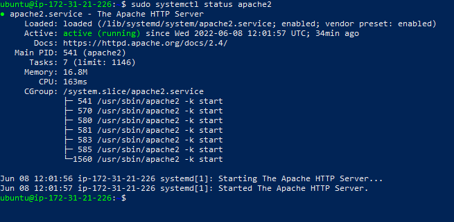
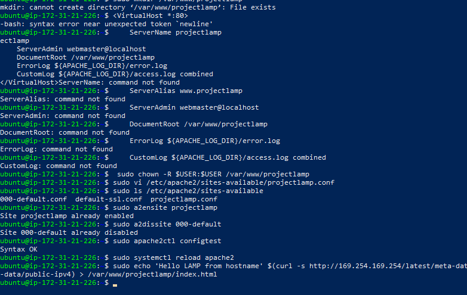
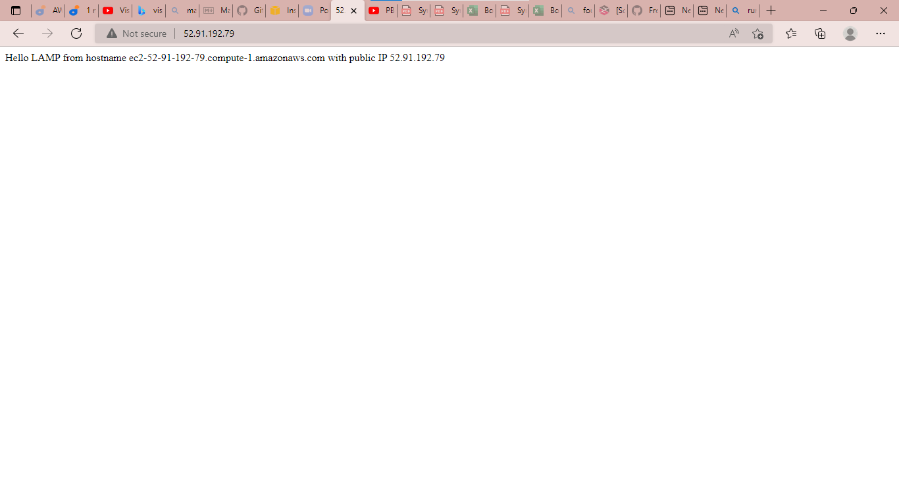

**LAMP STACK IMPLIMENTATION**

**INSTALLING THE COMPONENT OF LAMP**
 *The LAMP consist of Linux, Apache, Mysql and Php* 

*LINUX*
*Connecting To AWS EC2 instance*
 
I signed up and created a new Ubuntu Instance for my Project 1 LAMP stack which generated a .pem file which I downloaded from AWS to my PC.
 
I then connected to the server using the ssh and the .pem file with the windows Terminal ssh -i "project.pem" ubuntu@ec0-00-00-00-0.compute-1.amazonaws.com
0 is the reference of address
 
I updated  and upgraded the server using sudo apt-get update and apt-get upgrade.
 
i have just concluded the installing of the first element of LAMP , which is LINUX (ubuntu)
 
**INSTALLING THE COMPONENT OF LAMP  apache**
 
*APACHE (engine)*
 
I installed apache using sudo apt installed
 
I adjusted my firewall setting on EC2  to allow HTTP traffic.
 
checked status using sudo systemctl status apache2 which shows green dot to confirm the status active.
 

 
**INSTALLING THE COMPONENT OF LAMP  Mysql**
 
*MYSQL (Database)*
 
I installed Mysql using sudo apt install mysql-server
 

 
then connect to the MySQL server to authenticate installation by creating a Root User and password.
 
then open mysql using sudo mysql to connect to Database.
 
Username and password was created to connect remotely. I confirmed that I can n login into the MySQL console by using the $ sudo mysql -p.
 
**INSTALLING THE COMPONENT OF LAMP  php**
 
*PHP (coding)*
 
I installed php using the sudo apt install php libapache2-mod-php php-mysql
 
and confirm the installed version on my server by using the php -v
 

 

 
**CREATING A VIRTUAL HOST FOR YOUR WEBSITE USING APACHE**
 
The file named index.html will always take precedence over an index.php file, so we change the html to php with the code
 
`<IfModule mod_dir.c>
        #Change this:
        #DirectoryIndex index.html index.cgi index.pl index.php index.xhtml index.htm
        #To this:
        DirectoryIndex index.php index.html index.cgi index.pl index.xhtml index.htm
</IfModule>`
 
 
 A PHP test script was created to confirm that Apache is able to handle and process requests for PHP files using the sudo code.
 
`vim /var/www/projectlamp/index.php`
 
I added the following valid PHP code inside the file ,`<?php
phpinfo();`  and refresh the page.
 

